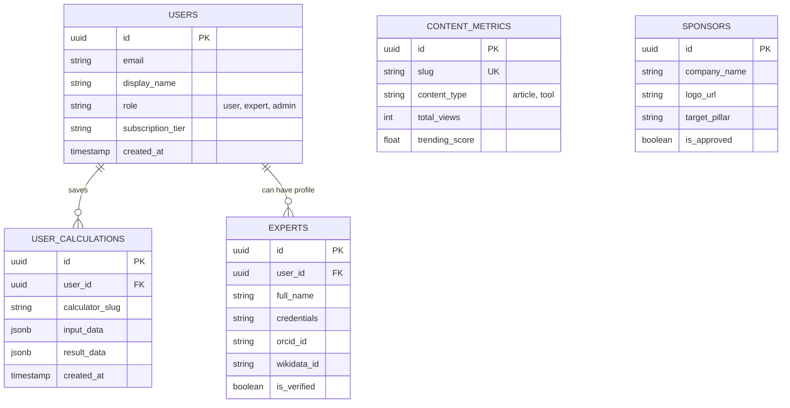

# Product Requirements & Specifications

This document outlines the product vision, role access paradigms, UX workflows, and programmatic marketing strategies of **LifeBloom Hub**.

---

## 1. Product Vision

LifeBloom Hub is an accessibility-first, AI-driven wellness portal created to provide high-value tools, plain-language resources, and expert-validated advice for modern adults and seniors. The application simplifies life administration across **5 Core Pillars**:
1. **Home & Smart Living:** Matter device matching, DIY renovation budget estimators, and utility energy tracking.
2. **Money & Future:** Simple retirement compounding tools, emergency fund planners, and federal bank yield comparison tables.
3. **Pet Family:** Dog/cat breed matching, veterinary rule-based symptom tracking, and nutrition guides.
4. **Senior Wellness:** Home fall-safety checklists, senior daily dietary trackers, and joint-health routines.
5. **Travel & Family:** Multi-generational accessible trip planners, senior-friendly itineraries, and budget builders.

---

## 2. 3-Tier Role-Based Access Control (RBAC)

The platform is designed to engage public visitors without barriers, while providing highly personalized, secured features for registered users and verified experts:

```
                  ┌────────────────────────────────────────┐
                  │            PUBLIC VISITOR              │
                  │ - Unhindered access to calculators     │
                  │ - Read articles & view comparison tools│
                  │ - Interacting with "Save" triggers CTA │
                  └───────────────────┬────────────────────┘
                                      │  Sign-up / Magic Link
                                      ▼
                  ┌────────────────────────────────────────┐
                  │      REGISTERED USERS & EXPERTS        │
                  │ - Personalized /dashboard area         │
                  │ - Save calculations & track progress   │
                  │ - Expert: ORCID/Wikidata credential panel│
                  └───────────────────┬────────────────────┘
                                      │  Admin Authorization
                                      ▼
                  ┌────────────────────────────────────────┐
                  │            PLATFORM ADMIN              │
                  │ - Full control via (admin) firewall    │
                  │ - Manage users, approve sponsorships   │
                  │ - Oversee content & system metrics     │
                  └────────────────────────────────────────┘
```

### 2.1. Tier 1: Public / Visitor (Inclusive & Open)
- **Objective:** Maximum SEO indexability and frictionless onboarding.
- **Capabilities:** Can adjust all calculator sliders, view comparison charts, and read all articles/guides.
- **Onboarding (Smart CTA):** Clicking any "Save Calculation", "Track Progress", or "Bookmark" button triggers a beautiful **Smart CTA Login Modal**, allowing the user to sign up immediately using a passwordless Magic Link.

### 2.2. Tier 2: Registered Users & Verified Experts (Exclusive & Trusted)
- **Standard User Capabilities:** A personalized `/dashboard` showing saved calculations, custom checklists, and accumulated progress points.
- **Expert Capabilities:** Registered users elevated to the `expert` role gain access to a dedicated **Authorship Panel** in their dashboard. Here, they can link their professional credentials:
  - verified **ORCID ID** (e.g., for doctors, researchers, financial experts).
  - verified **Wikidata ID** (e.g., for brands, organizations, established authors).
  - verified **OpenAlex Profile ID** (for scientific credibility).
  Once verified, their author profiles automatically render next to published articles, injecting premium E-E-A-T metadata.

### 2.3. Tier 3: Platform Admin (Maximized Security)
- **Objective:** Absolute security, compliance, and control.
- **Capabilities:** Admin route group `/(admin)` is protected by server-side middleware firewalls. Admins can promote users, review pending expert credentials, and manage sponsor approvals.

---

## 3. Database Entity Relationship Diagram (ERD)

The following diagram maps the database architecture and relational links between Users, Experts, saved items, and platform metrics:



---

## 4. User Stories & UX Flows

### 4.1. Frictionless Calculator Session Migration
- **User Story:** *As a visitor on a mobile phone, I want to calculate my DIY renovation budget and save it instantly without undergoing a long sign-up process.*
- **UX Flow:**
  1. Visitor inputs room details into the `DIY Budget Estimator`.
  2. The system stores the slider states and calculated values locally in `localStorage` inside a temporary anonymous session.
  3. Visitor clicks "Save to Account".
  4. The **Smart CTA** pops up asking for an Email.
  5. User receives a passwordless Magic Link -> clicks it -> signs in.
  6. A client-side migration listener detects the active anonymous session, pushes the saved parameters into Supabase, and clears the local cache.

### 4.2. Expert Professional Authorship E-E-A-T Setup
- **User Story:** *As a clinical researcher, I want to link my ORCID ID so that my articles display my academic credentials, building trust with senior readers.*
- **UX Flow:**
  1. Expert logs into their dashboard -> Dashboard panel detects `role === 'expert'`.
  2. Expert enters their ORCID number.
  3. The system queries public scholarly APIs to fetch credentials, matching names and qualifications.
  4. Upon approval, their published wellness guides display the trusted expert banner, complete with linked credentials.

---

## 5. Automated Virality & Growth Engine Loops

To drive zero-cost traffic, LifeBloom Hub utilizes two automated loops:

### 5.1. Loop A: Automated Pinterest Rich Pins
- **Trigger:** An internal Vercel Cron scans the database weekly for products (like Matter devices, ergonomic aids) that have dropped in price by >15%.
- **Action:** A serverless Edge Function compiles the product data, renders an attractive visual infographic (2:3 vertical aspect ratio), and uses the Pinterest Content API to publish it directly to the pilar's Pinterest board.
- **Result:** Organic visual search impressions funnel high-intent users directly to LifeBloom Hub's comparison pages.

### 5.2. Loop B: Dynamic Digital PR Trends
- **Trigger:** A monthly aggregation script anonymizes user calculator inputs (e.g., Average monthly retirement savings per age group).
- **Action:** Generates a public reporting landing page (e.g., `/reports/2026/retirement-trends`) with visual charts.
- **Result:** Auto-generated press release pitches are dispatched to regional lifestyle journalists and bloggers, acquiring high-quality editorial backlinks that skyrocket the domain's SEO authority.
